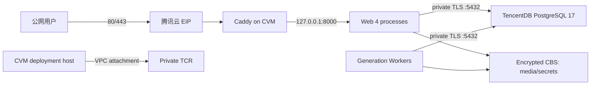

# 腾讯云单机生产部署设计与执行手册

本文对应云端生产就绪任务 05。仓库侧方案使用 OpenTofu 1.12.5、腾讯云 Provider 1.83.23、单台 CVM、独立加密 CBS、同地域腾讯云 PostgreSQL、私有 TCR、DNSPod 和主机 Caddy。它不创建 Kubernetes，也不改变 PostgreSQL 作为生成队列事实来源的 ADR 0001。

## 当前边界

代码已经能描述和校验云资源，但在取得目标账号、地域、域名、SSH Key、预算和 RTO/RPO 批准前，不执行真实 `apply`。首次真实发布仍必须创建版本标签，使供应链工作流产出经过扫描、带 SBOM/Provenance 且由 GitHub OIDC 签名的摘要；用户已明确暂不创建测试标签或测试镜像，因此仓库不会用未签名的临时镜像冒充部署证据。

腾讯云 Provider 1.83.23 的旧字段说明仍只列到 PostgreSQL 16，但 API 查询数据源允许按主版本查询。本配置固定要求 17，并在 `plan` 阶段查询 `tencentcloud_postgresql_db_versions`；目标地域没有 17 时会硬失败，禁止静默降级。此检查必须在选定地域使用真实账号完成。

## 上线前必须确认的输入

| 输入 | 由谁确认 | 退出条件 |
| --- | --- | --- |
| 地域与两个可用区 | 产品/合规/运维 | 数据地域合规；用户延迟可接受；CVM、PostgreSQL 17、CBS、TCR 均有库存 |
| 域名与备案 | 业务负责人 | DNSPod 可管理；中国大陆公网服务已满足备案和接入要求 |
| 预算 | 业务负责人 | 腾讯云价格计算器中的月度上限已书面批准，含流量、备份和日志增长余量 |
| RPO/RTO | 业务负责人/运维 | 建议起步目标 RPO 不超过 15 分钟、RTO 不超过 4 小时；任务 07 用恢复演练确认 |
| 运维入口 | 运维 | 现有腾讯云 SSH Key；固定公网 `/32`，禁止 `0.0.0.0/0` |
| 生产身份 | 安全/运维 | Terraform Runner、部署账号、CVM 运行身份分离；最小权限评审完成 |
| 发布摘要 | 发布负责人 | 版本发布门禁全绿，GHCR 源摘要和私有 TCR 目标摘要均可通过 Cosign 验签 |

## 网络与请求路径



### 端口矩阵

| 来源 | 目标 | 端口 | 控制 |
| --- | --- | --- | --- |
| 公网 | CVM/Caddy | TCP 80 | 仅 ACME 和 HTTPS 跳转 |
| 公网 | CVM/Caddy | TCP 443 | 唯一业务公网入口 |
| 固定运维 IP | CVM | TCP 22 | `operator_cidr`，通常为单个 `/32` |
| 应用安全组 | TencentDB | TCP 5432 | 私网安全组引用，不接受公网 CIDR |
| Caddy | 应用 | TCP 8000 | 仅宿主机回环绑定，安全组不开放 |
| CVM | TCR | HTTPS | 通过 TCR VPC Attachment 拉取私有镜像 |

安全组不开放数据库和应用端口。Caddy 是应用唯一直接代理，因此生产 `TRUSTED_PROXY_CIDRS` 固定为 `127.0.0.1/32`；不能把 VPC 或公网大网段加入可信代理。

## 资源与故障边界

- CVM 使用按量实例，避免预付实例阻碍预发布销毁演练。起步规格至少 2 vCPU/4 GiB，最终型号由目标可用区库存决定。
- 系统盘只保存操作系统、Docker、Caddy 和无敏感部署文件；媒体与 Provider 密钥位于独立加密 CBS 的 `/srv/infinite-canvas`。
- cloud-init 只安装运行工具和挂载服务，不接收数据库密码、Provider Key、支付密钥或 SMTP 密码。CBS 未挂载时部署脚本拒绝执行。
- 腾讯云 PostgreSQL 17 只使用私网、开启 SSL 和删除保护。默认应用池预算仍为 `4 × (8 + 4) + 4 × (2 + 1) = 60`，数据库规格必须至少再预留 20% 或 10 条连接（取较大值）给迁移、监控、备份和人工排障。
- TCR Namespace 为私有，开启自动扫描和 High 漏洞阻断，TCR 公网访问关闭。首次发布先在 GHCR 生成 GitHub OIDC 签名，再由 VPC 内部署主机用 `cosign copy` 把镜像及签名/证明复制到 TCR；复制后再次按 TCR 摘要验签。
- DNSPod A 记录指向独立 EIP。Caddy 自动申请和续期证书，强制 HTTP 跳转 HTTPS；SSE 使用 `flush_interval -1`，上游响应头超时为 11 分钟，超过当前生成绝对时限。
- 请求体入口默认 32 MB，超出由 Caddy 返回 413。若业务确需增加，必须同时验证应用上传限制、磁盘增长、Provider 限制和压测结果。

## IAM 与 Secret 边界

| 身份 | 允许 | 明确禁止 |
| --- | --- | --- |
| Terraform Runner | 指定项目的 VPC/CVM/CBS/PostgreSQL/TCR/DNSPod 变更；指定 COS state 前缀读写与锁 | 读取应用 Provider/SMTP/支付 Secret；日常登录业务主机 |
| 部署账号 | 受限 SSH；私有 TCR 登录/拉取；写 `/etc/infinite-canvas`；控制 Docker/Caddy | 修改 DNS、VPC、数据库公网策略；读取 Terraform state bucket |
| CVM 运行身份 | TCR 只读和云监控所需权限 | Terraform state、DNSPod、资源创建/删除、数据库管理员 API |
| 应用数据库账号 | 目标业务数据库和迁移所需权限 | 腾讯云资源控制面、其他数据库 |

`tencentcloud_postgresql_instance.root_password` 是 Provider 创建实例的必填字段，因此它会存在于 Terraform state，即使变量标记为 `sensitive`。本方案不声称可以从 state 中消除它，而是把 state 当作生产 Secret：使用独立私有 COS bucket、服务端加密、版本控制、最小前缀权限、访问日志和锁文件；后端凭据只从 Runner 环境注入。应用连接串、认证 HMAC、Provider Key、SMTP 和支付凭据不进入 Terraform、cloud-init、输出或 Git。

任务 06 将决定应用 Secret Manager/KMS 和媒体对象存储策略。在此之前，Provider 密钥依赖加密 CBS、`0700/0600` 权限和加密备份。

## 成本核算

提交审批前，必须在腾讯云价格计算器记录以下逐项月价和总价，不能用文档中的历史报价代替：

| 成本项 | 起步配置 | 主要增长因子 |
| --- | --- | --- |
| CVM | 至少 2 vCPU/4 GiB、50 GiB 系统盘 | Web/Worker CPU、活动用户、日志 |
| CBS | 100 GiB 加密云 SSD | 图片留存、上传、快照 |
| TencentDB PostgreSQL | 2 vCPU/4 GiB、100 GiB、可选跨可用区 | 连接、IOPS、备份保留、HA |
| TCR | Basic 私有实例 | 镜像容量、扫描、跨地域复制 |
| EIP | 10 Mbps、按流量 | 图片下载、上传、Provider 回源 |
| DNS/TLS/监控 | DNSPod、Caddy ACME、云监控 | 域名套餐、日志与指标保留 |

预算不足时先调整保留策略和非关键规格；不得通过公开数据库、关闭 TLS/备份/扫描或部署未签名镜像降本。

## 初始化与 Plan

1. 单独创建私有 COS state bucket，启用服务端加密、版本控制、访问日志和保留策略。复制 `deploy/tencent-cloud/infra/backend.hcl.example` 为被 Git 忽略的 `backend.hcl`。
2. 复制 `terraform.tfvars.example` 为 `terraform.tfvars`，填写真实地域、可用区、域名、运维 CIDR、SSH Key 和当前有库存的 CVM 类型。不要把密码写入 tfvars。
3. 从密码管理器向当前 Runner 注入数据库初始密码和腾讯云 API 凭据。
4. 格式化、初始化、校验并保存 Plan：

```powershell
$env:TF_VAR_postgresql_root_password = '<password-manager-value>'
tofu -chdir=deploy/tencent-cloud/infra init -backend-config=backend.hcl
tofu -chdir=deploy/tencent-cloud/infra fmt -check -recursive
tofu -chdir=deploy/tencent-cloud/infra validate
tofu -chdir=deploy/tencent-cloud/infra plan -out=production.tfplan
tofu -chdir=deploy/tencent-cloud/infra show -no-color production.tfplan
```

Plan 评审必须确认：没有 `0.0.0.0/0:22`、`0.0.0.0/0:5432` 或 `:8000`；数据库版本查询返回 17；TCR 公网关闭；DNS 指向新 EIP；磁盘加密；数据库删除保护；没有意外替换或删除。

只有获批 Plan 可以 `tofu apply production.tfplan`。Apply 后先通过腾讯云控制面与 CVM 执行：

```bash
cloud-init status --wait
systemctl status infinite-canvas-data.service
findmnt /srv/infinite-canvas
stat -c '%u:%g:%a' /srv/infinite-canvas/data/generated-media
stat -c '%u:%g:%a' /srv/infinite-canvas/secrets/providers
```

## 首次镜像晋级与部署

1. 首次真实发布前取得单独授权，创建正式版本标签；等待 `release-gate` 与 `supply-chain-gate` 全绿，记录 GHCR 源摘要、SBOM、漏洞报告和 Cosign 输出。
2. 在 CVM 登录私有 TCR，设置 GitHub Actions 身份边界，把签名镜像连同签名和证明复制到 TCR：

```bash
export COSIGN_CERTIFICATE_IDENTITY_REGEXP='^https://github.com/nannannan1111111/AI-platform/.github/workflows/supply-chain.yml@refs/tags/v[0-9].*$'
export COSIGN_CERTIFICATE_OIDC_ISSUER='https://token.actions.githubusercontent.com'
sudo --preserve-env=COSIGN_CERTIFICATE_IDENTITY_REGEXP,COSIGN_CERTIFICATE_OIDC_ISSUER \
  deploy/tencent-cloud/scripts/mirror-signed-image.sh \
  ghcr.io/nannannan1111111/ai-platform@sha256:<source> \
  <private-tcr>/infinite_canvas/application:<version>
```

脚本输出经过再次验签的 TCR 摘要。把它写入 `/etc/infinite-canvas/single-host.env` 的 `CREATIVE_STUDIO_IMAGE`；该文件权限必须是 `0600`。

3. 把仓库中的 `compose.production.yml` 放到 `/opt/infinite-canvas/`，把腾讯云 `Caddyfile` 和部署脚本放到同一发布目录。复制 `caddy.env.example` 为 `/etc/infinite-canvas/caddy.env`，权限 `0600`，域名必须与 `ALLOWED_HOSTS` 相同。
4. 部署脚本按固定次序执行：TCR 摘要验签 → Compose 解析和拉取 → Alembic 迁移 → Web/Worker 启动 → 回环 `/readyz` → Caddy 校验/启用 → 公网 HTTPS `/readyz`。任何前置步骤失败都不会首次开放 Caddy 流量。

```bash
export SITE_DOMAIN=studio.example.com
export COSIGN_CERTIFICATE_IDENTITY_REGEXP='^https://github.com/nannannan1111111/AI-platform/.github/workflows/supply-chain.yml@refs/tags/v[0-9].*$'
export COSIGN_CERTIFICATE_OIDC_ISSUER='https://token.actions.githubusercontent.com'
sudo --preserve-env=SITE_DOMAIN,COSIGN_CERTIFICATE_IDENTITY_REGEXP,COSIGN_CERTIFICATE_OIDC_ISSUER \
  deploy/tencent-cloud/scripts/deploy-release.sh
```

## 验收与回滚

在 CVM 和一台外部网络主机分别执行：

```bash
deploy/tencent-cloud/scripts/verify-edge.sh studio.example.com <expected-eip>
ss -lntp
docker compose --env-file /etc/infinite-canvas/single-host.env \
  -f /opt/infinite-canvas/compose.production.yml ps
```

还必须人工验证：

- 公网端口扫描仅发现 80/443；22 只对批准 CIDR 可达，5432/8000 不可达。
- HTTP 强制跳 HTTPS，证书链有效且自动续期正常；HSTS、CSP 和未知 Host 拒绝通过。
- SSE 在长任务中持续收到心跳且不被缓冲；32 MB 以上请求返回 413，边界内上传/下载正常。
- `/healthz` 只表示进程存活，数据库中断时 `/readyz` 失败；迁移故意失败时 Caddy 不首次开放。
- 支付通知只在任务 09 配置后验证，不因入口上线而提前启用支付。
- TencentDB 连接上限覆盖 60 条应用预算和运维预留；连接只来自私网。

基础设施回滚以获批 Plan、远端 state 版本、EIP/DNS 和数据库/CBS 备份点为边界。数据库删除保护默认开启；销毁演练必须使用隔离预发布账号，并在明确备份与批准后才临时关闭。应用版本回滚只能使用上一已验签摘要；若新版本已经执行不可向后兼容的迁移，不得只回滚镜像，必须按迁移发布说明恢复数据库。容量预算、灰度停止阈值、脱敏状态快照和规定时间内回滚步骤见 `docs/runbooks/capacity-canary-and-rollback.md`。当前单 CVM 入口不具备真正的百分比双版本分流能力，未增加第二实例与受控负载均衡前不得把 `limited` 阶段标为已执行。

部署完成后，按用户决定把 GitHub 仓库恢复为 `PRIVATE`，随后重新验证当前套餐是否仍能保持 `release-gate`、`supply-chain-gate`、PR、管理员不可绕过和线性历史规则；不能在保护失效时继续发布。
